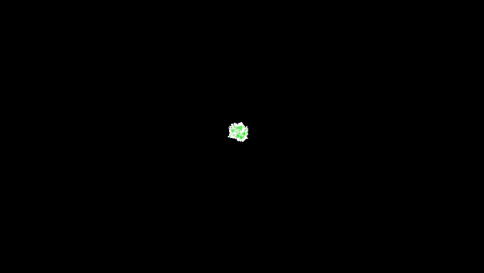

# Boids-SFML

A boids simulation made using C++ and SFML.

## Demo



## Requirements

- C++ compiler with support for C++14 (MSVC and GCC are actively tested).
- CMake Version 3.0.0.
- SFML 2.5.1 (Included as a submodule).

## Building

```bash
# Clone this project
$ git clone --resursive git@github.com:ufrshubham/Boids-SFML.git

# Go to project root
$ cd Boids-SFML/

# Make a build directory
$ cmake -E make_directory ./build

# Go to build directory
$ cd build/

# Configure cmake
$ cmake .. -DCMAKE_BUILD_TYPE=Release

# Build
$ cmake --build . --config Release
```

## References

- This project is based on [**jyanar/Boids**](https://github.com/jyanar/Boids).
